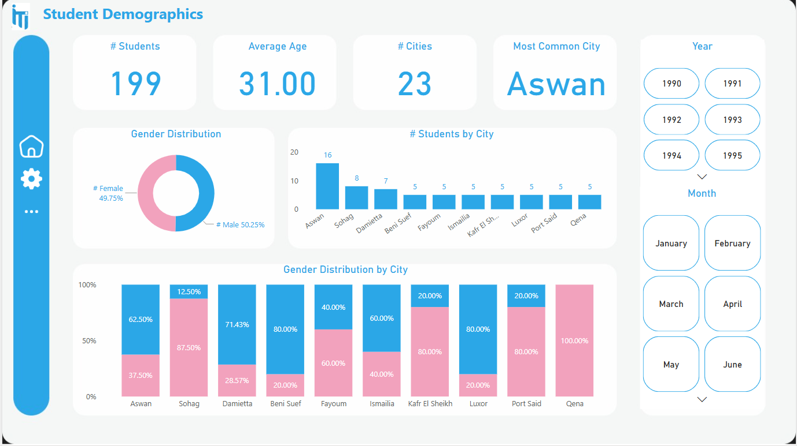

# 🎓 Online Examination System - Graduation Project (ITI)

## 📌 Project Overview

The **Online Examination System** is an end-to-end Business Intelligence (BI) solution designed and implemented as a graduation project during the ITI 4-month Power BI Development Track.
The system simulates a digital exam platform and focuses on data handling, analysis, and visualization using modern BI tools and techniques.

## 🛠️ Key Features

- 🧩 **ERD & Database Design**: Logical and physical database modeling using SQL Server.
- 🔗 **Data Integration**: Mapping and integrating transactional data into a centralized system.
- 🏗️ **Data Warehouse Implementation**: Built a star schema to support fast and efficient reporting.
- 📊 **BI Reporting with SSRS**: Developed structured reports for admins and stakeholders.
- 📈 **Interactive Dashboards with Power BI**: Delivered insightful, user-friendly dashboards for monitoring performance, user behavior, and exam statistics.

## 📂 Technology Stack

- **Database**: Microsoft SQL Server
- **Data Warehousing**: Star Schema, ETL Process
- **Reporting Tools**: 
  - Microsoft SSRS (SQL Server Reporting Services)
  - Power BI
- **Others**: SQL, DAX, T-SQL, Data Modeling

## 📊 Database Schema

### Key Entities

#### Student
  - **ST_ID (Primary Key)** - Unique identifier
  - **First_Name, Last_Name** - Student's name
  - **E_mail** - Login email
  - **Password** - Encrypted password
  - **Company_ID, Intake_ID, Track_ID, Branch_ID** - Organizational links

#### Instructor
  - **Instructor_ID (Primary Key)** - Unique identifier
  - **Name** - Full name
  - **Email** - Contact email
  - **Password** - Encrypted password
  - **Specialization** - Area of expertise

#### Exam
  - **Exam_ID (Primary Key)** - Unique identifier
  - **Title** - Exam Title
  - **Duration** - Time limit in minutes
  - **Total_Marks** - Maximum score
  - **Status** - Active, Inactive, Draft
  - **Created_Date** - Creation timestamp

#### Question
  - **Question_ID (Primary Key)** - Unique identifier
  - **Question_Text** - Question content
  - **Question_Type** - MCQ, True/False
  - **Difficulty_Level** - Easy, Medium, Hard
  - **Course_ID** - Associated course

## 📈 Sample Reports & Dashboards

### 📝 Exam Participation Overview
Provides insights into the number of students participating in exams over time.

---

### 📉 Pass/Fail Trends
Visualizes trends in student performance, highlighting pass/fail distribution and patterns.

---

### 📚 Student Performance Analysis
Shows detailed student scores, averages, and performance breakdown by subject or exam.

---

### 🧠 Exam Difficulty Insights
Analyzes question difficulty levels and how students are performing per difficulty tier.

---

### 🗃️ Top Performing Students
Summarizes statistics on the students performing: usage frequency, topic coverage, and position-type frequent.

## 👥 Team Members

This project was developed by a team of 4 members as part of the ITI Power BI Development Track.
Collaboration, organization, and shared commitment were key to delivering this solution.
  - **Omar Ashraf**
  - **Eslam Mohmed**
  - **Mokhtar Sameh**

## 📝 Lessons Learned

- Hands-on experience in transforming raw data into insights.
- Practical application of BI tools in a real-world-like scenario.
- Understanding the full data journey: from ERD to actionable dashboard.
- Working under real project deadlines and team coordination.
